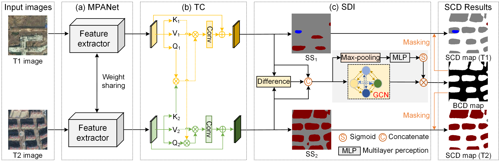

# HGINet

Official Pytorch Code base for "Semantic change detection using a hierarchical semantic graph interaction network from high-resolution remote sensing images"

[Project](https://github.com/long123524/HGINet-torch)

## Introduction

Our study aims to develop an effective multi-task network for SCD from high-resolution remote sensing images. We constructed a hierarchical semantic graph interaction network (i.e., HGINet) to simultaneously improve the identification of changed areas and categories. First, we designed an effective multi-level feature extractor to enhance the extraction of bi-temporal semantic features. Second, we qualified the interactions between different feature layers of the extracted features, the extracted difference features, and both, by graph learning. This improved the detection ability for complex SCD scenarios. Last, we concentrated on boosting the correlations between bi-temporal features for the unchanged areas. 

<p align="center">
  
</p>

## Using the code:

The code is stable while using Python 3.7, torch 1.10.0, CUDA 11.3

- Clone this repository:
```bash
git clone https://github.com/long123524/HGINet-torch
cd HGINet-torch
```

To install all the dependencies using conda or pip:

```
Torch+
timm
TensorboardX
OpenCV
numpy
tqdm
skimage
timm
....
```

## Data Format

Make sure to put the files as the following structure:

```
inputs
└── <train>
    ├── im1
    |   ├── 001.tif
    │   ├── 002.tif
    │   ├── 003.tif
    │   ├── ...
    |
    └── im2
    |   ├── 001.tif
    |   ├── 002.tif
    |   ├── 003.tif
    |   ├── ...
    └── label1
    |   ├── 001.tif
    |   ├── 002.tif
    |   ├── 003.tif
    |   ├── ...
    └── label2
    |   ├── 001.tif
    |   ├── 002.tif
    |   ├── 003.tif
    └── ├── ...
```

For validation and testing datasets, the same structure as the above.

## Training and testing

1. Train the model.
```
run train.SCD.py
```
2. Predict the SCD results.
```
run pred_SCD.py
```
3. Evaluate the SCD results.
```
run Eval_SCD.py
```
### Semantic change detection datasets: 

SECOND dataset: https://drive.google.com/file/d/1QlAdzrHpfBIOZ6SK78yHF2i1u6tikmBc/view
HRSCD dataset: https://ieee-dataport.org/open-access/hrscd-high-resolution-semantic-change-detection-dataset#files
We also release a Fuzhou non-agriculturalization dataset ("cropland" to "non-cropland") provided by our partner Haihan Lin: https://drive.google.com/file/d/1SlTw3jKr3cE6d3i5XYQhzylG0geMzNZW/view?usp=sharing

### Pretrained weight:
The weight of PVT-V2-B2 pretrained on ImageNet dataset can be downloaded from: https://drive.google.com/file/d/1uzeVfA4gEQ772vzLntnkqvWePSw84F6y/view?usp=sharing

### Acknowledgements: 

We are very grateful for these excellent works [CLCFormer](https://github.com/long123524/CLCFormer), [PVT](https://github.com/whai362/PVT), and [Bi-SRNet](https://github.com/ggsDing/Bi-SRNet), etc., which have provided the basis for our framework.

### Citation:
If you find this work useful or interesting, please consider citing the following references.
```
@article{long2024,
  title={Semantic change detection using a hierarchical semantic graph interaction network from high-resolution remote sensing images},
  author={Long, Jiang and Li, Mengmeng and Wang, Xiaoqin and Stein, Alfred},
  journal={ISPRS Journal of Photogrammetry and Remote Sensing},
  volume={211},
  pages={318--335},
  year={2024},
  publisher={Elsevier}
}

@article{lin2023,
  title={A multi-task consistency enhancement network for semantic change detection in HR remote sensing images and application of non-agriculturalization},
  author={Lin, Haihan and Wang, Xiaoqin and Li, Mengmeng and Huang, Dehua and Wu, Ruijiao},
  journal={Remote Sensing},
  volume={15},
  number={21},
  pages={5106},
  year={2023},
  publisher={MDPI}
}

@article{long2025,
  title={BGSNet: A boundary-guided Siamese multitask network for semantic change detection from high-resolution remote sensing images},
  author={Long, Jiang and Liu, Sicong and Li, Mengmeng and Zhao, Hang and Jin, Yanmin},
  journal={ISPRS Journal of Photogrammetry and Remote Sensing},
  volume={225},
  pages={221--237},
  year={2025},
  publisher={Elsevier}
}
```
